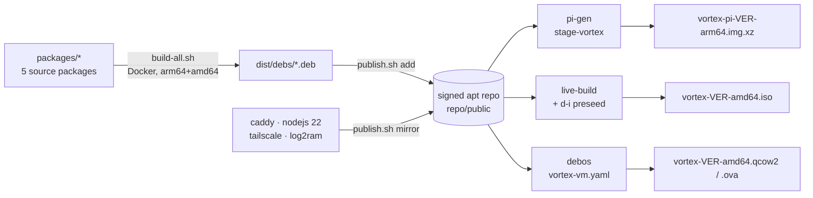
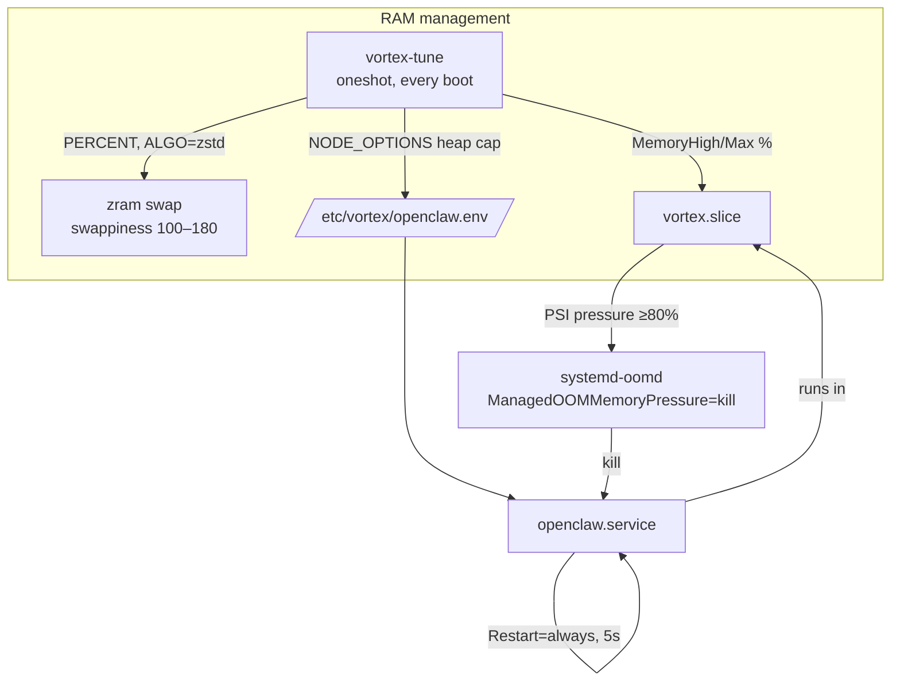
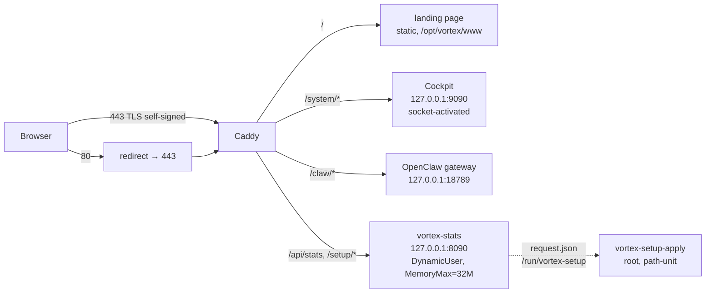

# Vortex OS — Architecture

## The one rule: identity lives in packages

Every behavior that makes a machine "Vortex" — branding, memory tuning,
hardening, web UI, OpenClaw — is a Debian package in `packages/`. The three
image pipelines are thin shells that install those packages onto a Debian 12
base from the self-hosted, GPG-signed apt repository. Fix once in a package →
all targets and all already-installed machines get it via `apt upgrade`.
If the same config ever appears in two pipelines, it's a bug: move it into a
package.

### The packages

| Package | Contents |
|---|---|
| `vortex-archive-keyring` | repo GPG public key + deb822 sources entry |
| `vortex-core` | os-release branding, MOTD, **vortex-tune**, vortex.slice, oomd policy, journald caps, SSH/fail2ban/ufw/sysctl hardening, vortex-slim |
| `vortex-core-sdcard` | log2ram, Pi pipeline only (SD wear) — never on SSD/VM targets |
| `vortex-webui` | Caddy entry point, Cockpit config, landing page, vortex-stats daemon (Go) |
| `vortex-openclaw` | OpenClaw pinned at **2026.6.6**, vendored node_modules in /opt/openclaw, hardened unit in vortex.slice, ships disabled |
| `vortex-firstboot` | host keys, growfs, setup code, web+console wizard, root-side applier |

Each target installs the identical set; only `vortex-core-sdcard` differs
(Pi only). All three pipelines bundle the signed `repo/public` tree as a
`file:` apt source at build time, so image builds are offline-capable and
exercise the exact bits users later get online.

## vortex-tune — the self-sizing memory brain

A oneshot (`vortex-tune.service`) ordered **before** `zramswap.service` and
`openclaw.service`, re-run on every boot because RAM can change (VMs, board
swaps). It reads MemTotal and generates: `/etc/default/zramswap`,
`/etc/sysctl.d/99-vortex-memory.conf`,
`/etc/systemd/system/vortex.slice.d/50-tuned.conf`, and
`/etc/vortex/openclaw.env` (Node heap + gateway port — single source of truth
read by openclaw.service *and* Caddy).

**The sizing table** (changing it requires explicit sign-off):

| Total RAM | zram size | swappiness | slice MemoryHigh | slice MemoryMax | Node --max-old-space-size |
|---|---|---|---|---|---|
| ≤ 2 GB | 60% | 180 | 55% | 65% | 768 MB |
| 2–4 GB | 50% | 180 | 55% | 70% | 1536 MB |
| 4–8 GB | 40% | 160 | 60% | 75% | 3072 MB |
| > 8 GB | 25% | 100 | 65% | 80% | 4096 MB |

All tiers share: `vm.page-cluster=0`, `vm.watermark_boost_factor=0`,
`vm.watermark_scale_factor=125`, `vm.vfs_cache_pressure=200`,
`vm.overcommit_memory=1`. zram uses zstd. Files carrying the
`# vortex-tune: manual` sentinel are never touched again.

Defense in depth, innermost first: V8 heap cap (`NODE_OPTIONS`) → cgroup
`MemoryHigh` (throttle+reclaim into zram) → `systemd-oomd` PSI kill at 80%
pressure → cgroup `MemoryMax` hard cap → kernel OOM killer (should never be
reached). OpenClaw always restarts; the rest of the system never starves.

## Runtime request flow

### Security model

- **SSH**: key-only (`PasswordAuthentication no`, `PermitRootLogin no`,
  fail2ban on the journal). First boot opens a temporary password window via
  `05-vortex-firstboot.conf`, removed the moment a key is enrolled.
- **One entry port**: ufw default-deny, allow 22+443 (rules in postinst,
  *enabled* only by firstboot — enabling ufw inside a build chroot can lock
  builders out; gated on `/run/systemd/system`).
- **Everything internal is localhost-only**: Cockpit (socket drop-in),
  OpenClaw gateway, stats daemon. Only Caddy faces the network.
- **Privilege separation in the wizard**: the web-facing daemon runs as a
  DynamicUser and can only write `request.json` into `/run/vortex-setup`
  (group `vortex-setup`); a root-side systemd **path unit** applies it.
  Secrets land in `/etc/vortex/openclaw-secrets.env` (0640 root:vortex) and
  are never logged or embedded in images.
- **Repo trust**: deb822 source pinned `Signed-By` to the Vortex keyring; the
  private key exists only offline + as a CI secret.

## Recorded decisions & tradeoffs

- **os-release**: `/etc/os-release` becomes a real file (`ID=vortex`,
  `ID_LIKE=debian`, `VERSION_CODENAME=bookworm` kept) while
  `/usr/lib/os-release` stays Debian's, so base-files upgrades don't undo
  branding. Tradeoff: tools that check `ID` exactly may balk; `ID_LIKE` +
  the kept codename cover virtually all third-party apt templates. Purging
  vortex-core restores the symlink.
- **Cockpit Origins**: deliberately unset. Behind a same-origin reverse proxy
  Cockpit validates the forwarded Host header, which works for vortex.local
  *and* any LAN IP without hardcoding origins (the spec's intent) —
  hardcoding `Origins` would break IP access.
- **systemd-oomd** is a separate bookworm package (`systemd-oomd`
  252.39-1~deb12u2) — verified, declared as a hard Depends of vortex-core.
- **Caddy/nodejs vendoring**: mirrored into the Vortex repo (aptly mirrors)
  rather than adding their upstream repos to machines — installed systems
  carry exactly two sources: Debian + Vortex.
- **OpenClaw vendoring**: `npm install openclaw@2026.6.6` at *package build*
  time into `/opt/openclaw` (npm `--os/--cpu` flags select per-arch optional
  deps for the arm64 cross build). Gateway port resolution uses the
  documented `OPENCLAW_GATEWAY_PORT` env var, fed from
  `/etc/vortex/openclaw.env`; config lives at `~/.openclaw/openclaw.json`
  (rendered from a template using only documented keys; provider keys are
  SecretRef-via-env). System-level unit per OpenClaw's documented systemd
  pattern, but always `Slice=vortex.slice` — the cage is non-negotiable.
- **ISO uses `--debian-installer live`**: the live squashfs is built with all
  Vortex packages preinstalled (from the bundled signed repo) and d-i copies
  it to disk — fully offline installs, and the installed bits are
  byte-identical to what the build tested. Tradeoff vs `cdrom` mode: less
  package-level flexibility at install time (we don't need any), and the two
  intentionally-interactive d-i questions (password, disk confirm) remain.
- **Boot menu theming** (ISO): kept to ISO labels + standard d-i entries;
  "manual partitioning" is reached by editing the kernel line (documented).
  Deep syslinux/grub template overrides were timeboxed out — revisit if the
  install UX matters more later.
- **debos over mkosi** for the VM target: YAML actions map 1:1 to our flow
  and the godebos/debos container runs on plain CI runners (KVM optional).
  Fallback documented in `targets/vm/build.sh` if it fights us in CI.
- **pi-gen pinned** at `de9df56` (bookworm branch, 2025-11-24); `ARMHF=0`
  for arm64. Only `stage-vortex` exports an image.
- **Build-deps via builder image, not debs** (`dpkg-buildpackage -d`): Go
  comes from the pinned official tarball (bookworm's golang is 1.19) and
  Node 22 from NodeSource — the builder Dockerfile is the toolchain
  manifest.
- **Default Pi password** `vortex/vortex` (overridable in Raspberry Pi
  Imager): needed for a usable console before the wizard; the wizard forces
  a real password and SSH goes key-only right after.

## Idle RAM budgets

≤150 MB on the Pi image, ≤200 MB on amd64, measured before OpenClaw starts
(asserted by `tools/qemu-test`). Kept honest by: no desktop/X/audio/bluetooth
/printing stacks (vortex-slim), socket-activated Cockpit (~0 when idle),
32 MB-capped stats daemon, journald capped at 50 MB.
